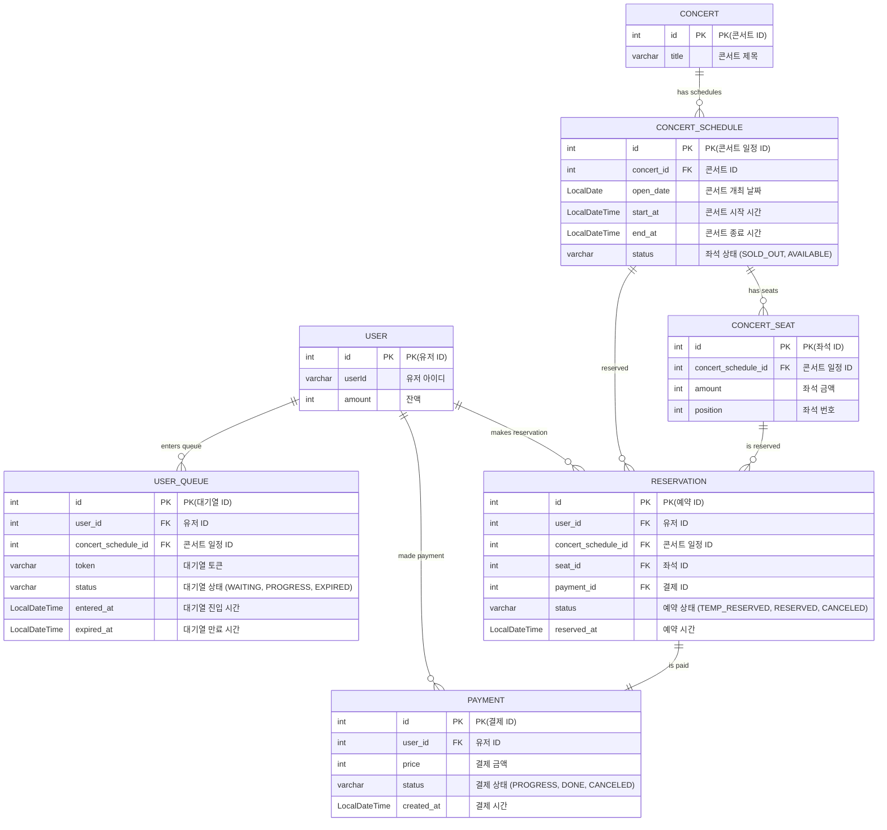

## **[ ERD ]**

```mermaid
erDiagram
    USER {
        int id PK "PK(유저 ID)"
        varchar userId "유저 아이디"
        int amount "잔액"
    }

    USER_QUEUE {
        int id PK "PK(대기열 ID)"
        int user_id FK "유저 ID"
        int concert_schedule_id FK "콘서트 일정 ID"
        varchar token "대기열 토큰"
        varchar status "대기열 상태 (WAITING, PROGRESS, EXPIRED)"
        LocalDateTime entered_at "대기열 진입 시간"
        LocalDateTime expired_at "대기열 만료 시간"
    }

    PAYMENT {
        int id PK "PK(결제 ID)"
        int user_id FK "유저 ID"
        int price "결제 금액"
        varchar status "결제 상태 (PROGRESS, DONE, CANCELED)"
        LocalDateTime created_at "결제 시간"
    }

    CONCERT {
        int id PK "PK(콘서트 ID)"
        varchar title "콘서트 제목"
    }

    CONCERT_SCHEDULE {
        int id PK "PK(콘서트 일정 ID)"
        int concert_id FK "콘서트 ID"
        LocalDate open_date "콘서트 개최 날짜"
        LocalDateTime start_at "콘서트 시작 시간"
        LocalDateTime end_at "콘서트 종료 시간"
        varchar status "좌석 상태 (SOLD_OUT, AVAILABLE)"
    }

    CONCERT_SEAT {
        int id PK "PK(좌석 ID)"
        int concert_schedule_id FK "콘서트 일정 ID"
        int amount "좌석 금액"
        int position "좌석 번호"
    }

    RESERVATION {
        int id PK "PK(예약 ID)"
        int user_id FK "유저 ID"
        int concert_schedule_id FK "콘서트 일정 ID"
        int seat_id FK "좌석 ID"
        int payment_id FK "결제 ID"
        varchar status "예약 상태 (TEMP_RESERVED, RESERVED, CANCELED)"
        LocalDateTime reserved_at "예약 시간"
    }

    CONCERT ||--o{ CONCERT_SCHEDULE: "has schedules"
    CONCERT_SCHEDULE ||--o{ CONCERT_SEAT: "has seats"
    USER ||--o{ USER_QUEUE: "enters queue"
    USER ||--o{ PAYMENT: "made payment"
    USER ||--o{ RESERVATION: "makes reservation"
    CONCERT_SCHEDULE ||--o{ RESERVATION: "reserved"
    RESERVATION ||--|| PAYMENT: "is paid"
    CONCERT_SEAT ||--o{ RESERVATION: "is reserved"
```